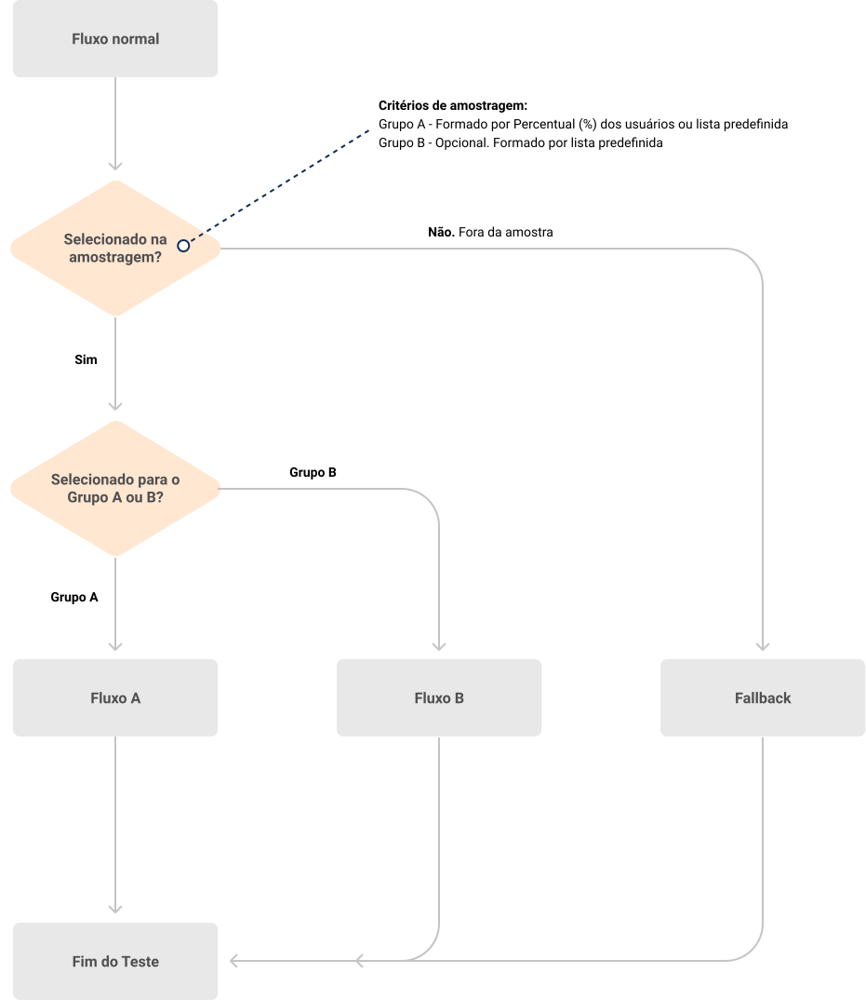

# Teste A/B

Este componente faz a decisão de um teste A/B dentro do fluxo. Com ele é possivel decidir um fluxo a partir de uma porcentagem, grupo seleto de usuários ou dois grupos de usuários com fallback para usuários não definidos em nenhum dos grupos (Teste A/B/C).

| Informações |                            |
|-------------|----------------------------|
| **Versão**  | 1.0                        |
| **Idioma**  | en-US                      |
| **Figma**   | [.fig](./ab-testing.fig)   |
| **Fluxo**   | [.svg](./ab-testing.svg)   |
| **Código**  | [.json](./ab-testing.json) |

## Dependencias

- Váriavel de `Contexto` de nome `abTestConfig`, mais detalhes no tópico de [entrada da comunicação](#Entrada).

## Comunicação

A configuração do componente é feita a partir da váriavel `abTestConfig`.

### Entrada

O componente espera uma váriavel do tipo `object`, que sempre deve ter os campos `type` e `options`.

| Campo   | Tipo     | Descrição                       |
|---------|----------|---------------------------------|
| type    | `string` | tipo de teste A/B               |
| options | `object` | configurações do tipo escolhido |

```json
{
    "type": "percent | groups | selected",
    "options": {
        "percent": 50,
        "selected": "selected@broadcast.msging.net",
        "groups": {
            "a": "group-a@broadcast.msging.net",
            "b": "group-b@broadcast.msging.net"
        }
    }
}
```

#### type

O campo `type` é uma `string` com os possiveis valores:
| type     |
|----------|
| percent  |
| selected |
| groups   |

#### options

O campo `options` é um `object` com os possiveis campos:
| Campo    | Tipo      | Descrição                                                                                                                         |
|----------|-----------|-----------------------------------------------------------------------------------------------------------------------------------|
| percent  | `integer` | Porcentagem de usuários que devem seguir no **fluxo A**                                                                           |
| selected | `string`  | `identity` da [lista de distribuição][broadcast] dos usuários que devem seguir no **fluxo A**                                     |
| groups   | `object`  | `identities` das [listas de distribuição][broadcast] do grupo A e grupo B de usuários que devem seguir em seus respectivos fluxos |

##### groups

| Campo | Tipo     | Descrição                                                                                   |
|-------|----------|---------------------------------------------------------------------------------------------|
| a     | `string` | `identity` da [lista de distribuição][broadcast] de usuários que devem seguir o **fluxo A** |
| b     | `string` | `identity` da [lista de distribuição][broadcast] de usuários que devem seguir o **fluxo B** |

#### Exemplos

Alguns exemplos de valores da váriavel `abTestConfig`

##### Fluxo com 85% dos usuários

Aproximadamente 85% dos usuários serão direcionados para o fluxo `A` enquanto o restante será direcionado para o `FALLBACK`.

```json
{
    "type": "percent",
    "options": {
        "percent": 85
    }
}
```

##### Fluxo para usuários de uma lista

Todos os usuários presentes na [lista de distribuição][broadcast] serão direcionados para o fluxo `A` e o restante para o `FALLBACK`.

```json
{
    "type": "selected",
    "options": {
        "selected": "new-payment-users@broadcast.msging.net"
    }
}
```

##### Fluxo diferentes para usuários especificos

Usuários do grupo a serão direcionados para o fluxo `A` e do grupo b para o fluxo `B`, já os usuários que não pertencem a nenhuma das listas serão direcionados para o `FALLBACK`.

```json
{
    "type": "groups",
    "options": {
        "groups": {
            "a": "br-users@broadcast.msging.net",
            "b": "na-users@broadcast.msging.net"
        }
    }
}
```

### Saida

O componente vai direcionar o usuário baseado na váriavel `abGroup` que pode ter os seguintes valores:

| Valor    | Descrição                                       |
|----------|-------------------------------------------------|
| A        | Usuário deve ir para o fluxo A                  |
| B        | Usuário deve ir para o fluxo B                  |
| FALLBACK | Usuários que não estão dentro do fluxo de teste |

## Preview



[broadcast]: https://docs.blip.ai/#broadcast
