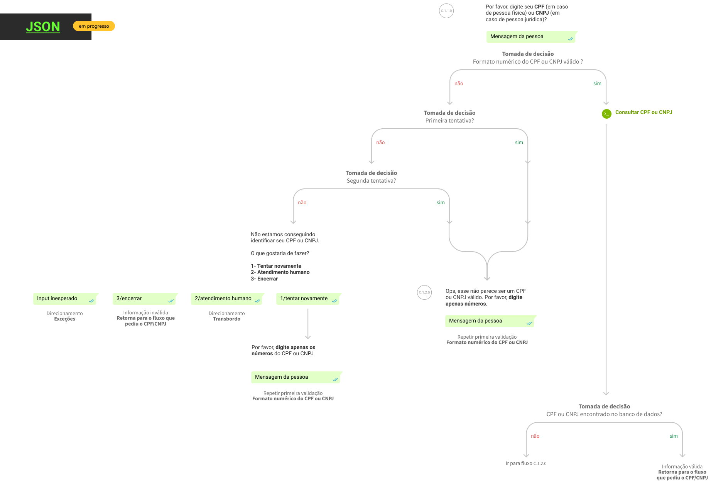

# Validador de CPF/CNPJ

Esse fluxo valida o número de CPF ou de CNPJ de um usuário a partir da entrada do número correspondente.
Há uma tolerância de 3 tentativas antes oferecer uma saída do fluxo.

| Informações |                                    |
|-------------|------------------------------------|
| **Versão**  | 1.0                                |
| **Idioma**  | pt-BR                              |
| **Figma**   | [.fig](./validador-cpf-cnpj.fig)   |
| **Fluxo**   | [.svg](./validador-cpf-cnpj.svg)   |
| **Código**  | [.json](./validador-cpf-cnpj.json) |

## Dependencias

- API que consulte o número na base de dado do cliente
- fluxo de input inesperado (opcional se usar regex para o formato do número)
- fluxo de transbordo (opcional se remover a opção do menu)

## Comunicação

Aqui deve ser exposta como é feita a comunicação com este componente (qual entrada e qual saida).

## Preview

